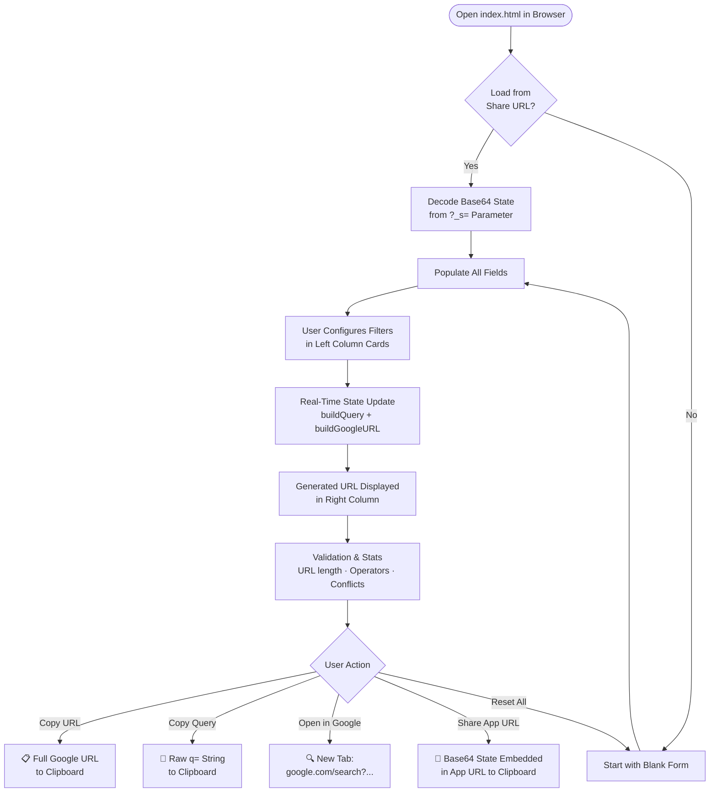
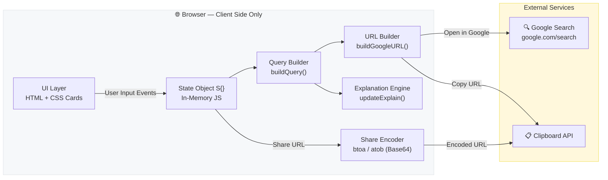

# xsukax Google Search Builder

> **Craft precision Google searches — no syntax knowledge required.**

[](https://www.gnu.org/licenses/gpl-3.0)
[](https://github.com/xsukax/xsukax-Google-Search-Builder)
[](https://github.com/xsukax/xsukax-Google-Search-Builder)
[](https://github.com/xsukax/xsukax-Google-Search-Builder)

---

## Table of Contents

- [Project Overview](#project-overview)
- [Security and Privacy Benefits](#security-and-privacy-benefits)
- [Features and Advantages](#features-and-advantages)
- [Installation Instructions](#installation-instructions)
- [Usage Guide](#usage-guide)
  - [Application Layout](#application-layout)
  - [Building Your First Query](#building-your-first-query)
  - [Operator Reference](#operator-reference)
  - [Shareable URLs](#shareable-urls)
  - [Quick Presets](#quick-presets)
  - [Workflow Diagram](#workflow-diagram)
  - [Architecture Diagram](#architecture-diagram)
  - [PHP Server Hosting Notes (php.ini)](#php-server-hosting-notes-phpini)
- [Licensing Information](#licensing-information)

---

## Project Overview

**xsukax Google Search Builder** is a fully self-contained, single-file web application (`index.html`) that empowers researchers, developers, analysts, journalists, and everyday users to construct complex Google search queries through an intuitive graphical interface — no memorization of operator syntax required.

Google's advanced search operators (`site:`, `inurl:`, `filetype:`, `AROUND()`, `daterange:`, and many more) are exceptionally powerful but widely underutilized due to their non-obvious syntax. This tool eliminates that barrier entirely: users compose their query visually, and the application assembles the correct, properly encoded Google Search URL in real time.

**Primary functionalities include:**

- Visual construction of multi-operator Google search queries with live URL preview
- Support for 17+ distinct Google search operators
- Real-time plain-English explanation of every active operator
- One-click execution, URL copying, or shareable link generation
- Quick-start presets for common research workflows
- Zero installation, zero accounts, zero server infrastructure

---

## Security and Privacy Benefits

xsukax Google Search Builder is designed from the ground up with a privacy-first, trust-by-design philosophy. Every architectural decision reinforces user confidentiality and data sovereignty.

### No Data Leaves Your Device

The entire application is a **single static HTML file** (`index.html`). All query-building logic, operator assembly, URL generation, and state management execute exclusively in your browser. There is no backend server, no API endpoint, no database, and no telemetry infrastructure. Your search terms, domain filters, date ranges, and any other inputs you provide are never transmitted to any third party (other than Google itself, when you choose to execute the search).

### No Cookies, No Tracking, No Analytics

The application sets no cookies, does not use `localStorage` or `sessionStorage`, and incorporates no analytics scripts, advertising SDKs, or third-party tracking pixels. Each session is entirely stateless and ephemeral — closing the browser tab leaves no trace of your session data.

### Shareable State via URL Parameter Only

When you use the **Share App URL** feature, your current query configuration is serialized into a Base64-encoded JSON string and embedded as a single URL query parameter (`?_s=...`) in the application's own URL. This share payload is self-contained, requires no server-side storage, and is decoded purely client-side. No user data is ever written to or read from any external service.

### Transparent, Auditable Source Code

The entire application is contained within a single, human-readable `index.html` file with no minified third-party bundles, no obfuscated logic, and no dynamic script injection from remote origins. Any user can inspect every line of code directly in their browser's DevTools or a text editor, ensuring complete auditability.

### XSS-Safe Output Rendering

All user-supplied input is HTML-escaped via a dedicated `esc()` function before being rendered into the DOM, preventing cross-site scripting vulnerabilities in the generated URL preview and explanation panels.

### Open Source & GPL-Licensed

Because the project is fully open source under the GPL-3.0 license, the security posture of the application is subject to community review, and any security-relevant modifications to distributed versions are required to be disclosed under the same license terms.

---

## Features and Advantages

| Feature | Description |
|---|---|
| **Zero Dependencies** | No npm, no bundler, no framework — one HTML file that runs anywhere |
| **Real-Time URL Preview** | The full Google search URL updates on every keystroke |
| **Plain-English Explanation** | Every active operator is described in plain language as you build |
| **17+ Operators Supported** | Full coverage of Google's documented advanced search operators |
| **AND / OR / NOT Logic** | Boolean keyword combinations with visual toggle buttons |
| **Exact Phrase Matching** | Automatic quoting for multi-word phrases |
| **Domain Include & Exclude** | `site:` and `-site:` filters with toggle button |
| **URL / Title / Body Filters** | `inurl:`, `intitle:`, `intext:` with include/exclude toggling |
| **Proximity Search** | `AROUND(n)` operator with configurable word distance |
| **Numeric Range** | `..` range operator for prices, years, measurements |
| **35+ File Type Filters** | `filetype:` with dropdown + custom extension support |
| **Special Operators** | `related:`, `cache:`, `define:` in one panel |
| **Date Filtering** | Quick presets, custom duration, or explicit calendar date range (auto-converts to Julian Day Numbers for `daterange:`) |
| **Search Type Selection** | Web, Images, News, Videos, Shopping, Books |
| **Language & Country Targeting** | `lr=` and `gl=` parameters with full dropdown lists |
| **SafeSearch Control** | Explicit on/off toggle |
| **Results Per Page** | `num=` parameter (10 / 20 / 50 / 100) |
| **URL Length Guard** | Live character count with yellow/red warnings at 1800/2048 chars |
| **Conflict Detection** | Warns when the same domain is both included and excluded |
| **Quick Presets** | One-click templates for common research patterns |
| **Shareable URLs** | Full query state encoded into a single URL parameter |
| **Fully Responsive** | Two-column desktop layout collapses to single-column on mobile |
| **Offline Capable** | Works without an internet connection (except to execute the search) |

---

## Installation Instructions

Because xsukax Google Search Builder is a single static HTML file, deployment is trivial across all platforms.

### Option 1 — Open Directly in Your Browser (No Setup)

```bash
# Clone the repository
git clone https://github.com/xsukax/xsukax-Google-Search-Builder.git

# Navigate into the project directory
cd xsukax-Google-Search-Builder

# Open the file in your default browser
# macOS
open index.html

# Linux (xdg-open or your preferred browser)
xdg-open index.html

# Windows (PowerShell)
Start-Process index.html
```

> **Note:** The Share App URL feature requires `navigator.clipboard`, which browsers restrict to HTTPS origins or `localhost`. If you are opening the file directly via `file://` and need share functionality, use Option 2 or 3.

---

### Option 2 — Serve Locally with Python

```bash
# Python 3 (serves on http://localhost:8000)
python3 -m http.server 8000

# Then open in your browser
open http://localhost:8000
```

---

### Option 3 — Serve Locally with Node.js

```bash
# Install a simple static server globally (one-time)
npm install -g serve

# Serve the project directory
serve .

# Then open the URL shown in your terminal (typically http://localhost:3000)
```

---

### Option 4 — Deploy to a Static Hosting Provider

Since the application is a single `index.html` file, it deploys to any static host without configuration:

| Platform | Deployment Method |
|---|---|
| **GitHub Pages** | Push `index.html` to the `gh-pages` branch or enable Pages on `main` |
| **Netlify** | Drag-and-drop the `index.html` file into the Netlify dashboard |
| **Vercel** | `vercel --prod` from the project directory |
| **Cloudflare Pages** | Connect your GitHub repository and deploy with default settings |
| **Any Web Host** | Upload `index.html` via FTP/SFTP — no build step required |

---

### Option 5 — Self-Host on a PHP-Enabled Server

See the [PHP Server Hosting Notes](#php-server-hosting-notes-phpini) section for recommended `php.ini` settings when serving this file from an Apache or Nginx + PHP-FPM environment.

---

## Usage Guide

### Application Layout

The interface is divided into two panels:

```
┌─────────────────────────────────┬──────────────────────┐
│         LEFT COLUMN             │     RIGHT COLUMN     │
│  (Query Builder — Inputs)       │  (Output & Actions)  │
│                                 │                      │
│  🔤 Keywords                    │  ⚡ Quick Presets   │
│  💬 Exact Phrases               │  🔗 Generated URL   │
│  🌐 Site / Domain               │  📖 Explanation     │
│  🔗 URL Contains                │                      │
│  📑 Title Contains              │                      │
│  📄 Body Text Contains          │                      │
│  ↔️  Proximity Search           │                      │
│  🔢 Numeric Range               │                      │
│  📁 File Type                   │                      │
│  ⚡ Special Operators           │                      │
│  📅 Date Filtering              │                      │
│  ⚙️  Search Settings            │                      │
│  🗺️  Language & Region          │                      │
└─────────────────────────────────┴──────────────────────┘
```

Each section in the left column is a collapsible card. Click the card header to expand or collapse it. The right column is sticky on desktop, keeping the generated URL and action buttons always visible.

---

### Building Your First Query

**Step 1 — Enter keywords**

In the **Keywords** card, type your primary search term. For a second keyword, click **＋ Add Keyword** and choose `AND`, `OR`, or `NOT` to define the boolean relationship.

- Multi-word keywords are automatically wrapped in quotes.
- `NOT` prepends a `-` operator to exclude the term.

**Step 2 — Add optional filters**

Expand any additional cards to layer operators:
- Enter a domain in **Site / Domain** and toggle between `site:` (include) and `-site:` (exclude).
- Select a file type from the **File Type** dropdown or enter a custom extension.
- Use **Date Filtering** to restrict results by recency.

**Step 3 — Review the output**

The **Generated URL** panel in the right column updates in real time. Status badges below the URL show:
- Total operator count
- Query character length
- Full URL length (with a warning at 1800 chars and an error at 2048 chars)
- Active search type

**Step 4 — Execute or share**

| Button | Action |
|---|---|
| 📋 **Copy URL** | Copies the full `https://www.google.com/search?...` URL |
| 📝 **Copy Query** | Copies only the raw query string (the `q=` value) |
| 🔍 **Open in Google** | Opens the search in a new tab immediately |
| 🔗 **Share App URL** | Copies a shareable URL that restores your exact configuration |
| 🗑️ **Reset All** | Clears all fields and resets to a blank state |

---

### Operator Reference

| Operator | Builder Section | Example Output |
|---|---|---|
| Keyword `AND` | Keywords | `python django` |
| Keyword `OR` | Keywords | `python OR ruby` |
| Keyword `NOT` | Keywords | `python -django` |
| Exact phrase | Exact Phrases | `"machine learning"` |
| Include domain | Site / Domain | `site:github.com` |
| Exclude domain | Site / Domain | `-site:pinterest.com` |
| URL contains | URL Contains | `inurl:blog` |
| Title contains | Title Contains | `intitle:"annual report"` |
| Body text | Body Text Contains | `intext:climate` |
| Proximity | Proximity Search | `climate AROUND(5) change` |
| Numeric range | Numeric Range | `500..1000` |
| File type | File Type | `filetype:pdf` |
| Related sites | Special Operators | `related:nytimes.com` |
| Cached page | Special Operators | `cache:example.com` |
| Definition | Special Operators | `define:serendipity` |
| Date range | Date Filtering | `daterange:2458849-2459215` |
| Quick date | Date Filtering | `tbs=qdr:m1` |
| Search type | Search Settings | `tbm=nws` |
| Language | Language & Region | `lr=lang_en` |
| Country | Language & Region | `gl=us` |
| SafeSearch | Search Settings | `safe=active` |
| Results count | Search Settings | `num=50` |

---

### Shareable URLs

When you click **🔗 Share App URL**, the application serializes the entire current state (all keywords, filters, date settings, and output preferences) into a compact Base64-encoded JSON payload and appends it to the application's own URL as `?_s=<payload>`.

Sharing that URL with a colleague allows them to open the application with your exact configuration pre-loaded — no copy-pasting of query strings required.

```
https://yourdomain.com/index.html?_s=eyJrdyI6W3sidjoic2VjdX...
```

The decoding occurs entirely in the browser and requires no server-side session or database.

---

### Quick Presets

The **⚡ Quick Presets** panel provides one-click templates for common research workflows. Applying a preset resets the current state and populates the appropriate fields automatically.

Available presets include:

- **PDF Research** — Filetype PDF + academic site filters
- **Gov & Edu Docs** — `.gov` / `.edu` domain targeting
- **Recent News** — News search type + last 24-hour date filter
- **GitHub Code Search** — `site:github.com` scoped search
- **Reddit Discussions** — `site:reddit.com` scoped search
- **Academic Papers** — Scholar and repository targeting
- **Recent Articles** — Blog URL filter + past-month date window
- **Deep Site Search** — Single-domain search template

---

### Workflow Diagram

The following diagram illustrates the end-to-end user workflow:



---

### Architecture Diagram



> All processing is confined to the browser. No data traverses a backend.

---

### PHP Server Hosting Notes (php.ini)

If you choose to serve `index.html` from an Apache or Nginx + PHP-FPM server (e.g., as part of a broader PHP-based site), the application itself requires no PHP processing — it is a static file. However, the following `php.ini` settings are recommended to ensure the server delivers the file correctly and that the clipboard and sharing features work as expected over HTTPS.

**Ensure HTTPS is enforced** (required for `navigator.clipboard` API):

```ini
; php.ini — recommended settings for hosting static files alongside PHP apps

; Ensure sessions and output buffering do not interfere with static file delivery
output_buffering = Off
zlib.output_compression = Off

; Prevent PHP from processing .html files (important — avoids unintended execution)
; Set this in your Apache .htaccess or Nginx config instead:
; AddType text/html .html  (Apache)
; types { text/html html; }  (Nginx)

; If using PHP to serve the file dynamically, set correct content type
default_mimetype = "text/html"
default_charset = "UTF-8"

; Security headers (set via your web server config for static files)
; Recommended headers to add in Apache/Nginx:
; Content-Security-Policy: default-src 'self'; script-src 'self' 'unsafe-inline'
; X-Content-Type-Options: nosniff
; X-Frame-Options: SAMEORIGIN
; Referrer-Policy: strict-origin-when-cross-origin
```

**Apache `.htaccess` snippet** (place in the project root):

```apache
# Force HTTPS — required for Clipboard API
RewriteEngine On
RewriteCond %{HTTPS} off
RewriteRule ^ https://%{HTTP_HOST}%{REQUEST_URI} [L,R=301]

# Serve index.html with correct charset
AddDefaultCharset UTF-8
AddType "text/html; charset=utf-8" .html

# Security headers
Header always set X-Content-Type-Options "nosniff"
Header always set X-Frame-Options "SAMEORIGIN"
Header always set Referrer-Policy "strict-origin-when-cross-origin"
```

**Nginx server block snippet**:

```nginx
server {
    listen 443 ssl;
    server_name yourdomain.com;

    root /var/www/xsukax-Google-Search-Builder;
    index index.html;

    # Serve the static file directly — no PHP processing
    location / {
        try_files $uri $uri/ =404;
        add_header Content-Type "text/html; charset=utf-8";
        add_header X-Content-Type-Options "nosniff";
        add_header X-Frame-Options "SAMEORIGIN";
        add_header Referrer-Policy "strict-origin-when-cross-origin";
    }
}
```

> No `php.ini` modifications are required for the application's core functionality. The settings above are server-hardening recommendations for a production PHP-enabled environment.

---

## Licensing Information

This project is licensed under the **GNU General Public License v3.0** — see the [LICENSE](https://www.gnu.org/licenses/gpl-3.0.html) file for full terms.
